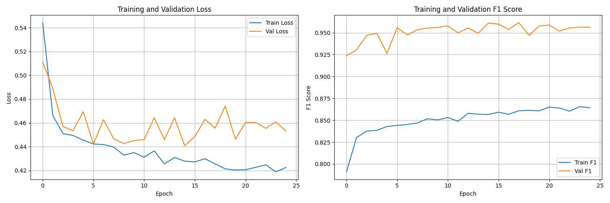

# Candlestick Pattern Recognition with CNNs and ViTs

This is a report of an experiment I recently concluded that shows how well Convolutional Neural Networks (CNNs) and Vision Transformers (ViTs) can classify candlestick patterns from images. It includes everything end‑to‑end: downloading data, labeling patterns with TA‑Lib, rendering clean candlestick images, splitting by date, training CNN and ViT models, and comparing them fairly. The repo ends with a solid baseline you can deploy and a clear path to a real‑time system.

## Table of Contents
- [Candlestick Pattern Recognition with CNNs and ViTs](#candlestick-pattern-recognition-with-cnns-and-vits)
  - [Table of Contents](#table-of-contents)
  - [Background and Goals](#background-and-goals)
  - [Methodology Overview](#methodology-overview)
    - [Pipeline Overview](#pipeline-overview)
  - [Dataset Preparation](#dataset-preparation)
  - [Models and Training](#models-and-training)
  - [Experimental Timeline](#experimental-timeline)
  - [Results and Discussion](#results-and-discussion)
    - [Key Figures](#key-figures)
      - [CNN (ResNet34) – Training History](#cnn-resnet34--training-history)
      - [CNN (ResNet34) – Confusion Matrix (Test)](#cnn-resnet34--confusion-matrix-test)
      - [ViT (DeiT‑Tiny, Pretrained) – Training History](#vit-deittiny-pretrained--training-history)
      - [ViT (DeiT‑Tiny, Pretrained) – Confusion Matrix (Test)](#vit-deittiny-pretrained--confusion-matrix-test)
      - [CNN vs ViT – Overall Metrics (Test)](#cnn-vs-vit--overall-metrics-test)
      - [CNN vs ViT – Per‑Class F1 (Test)](#cnn-vs-vit--perclass-f1-test)
  - [How to Run](#how-to-run)
    - [Prerequisites](#prerequisites)
    - [1) Environment](#1-environment)
    - [2) Configure](#2-configure)
    - [3) Data pipeline](#3-data-pipeline)
    - [4) Train models](#4-train-models)
    - [5) Compare](#5-compare)
  - [Reproducibility Notes](#reproducibility-notes)
  - [Conclusions](#conclusions)
  - [What’s Next: Real-time Detection](#whats-next-real-time-detection)
  - [Project Structure](#project-structure)
  - [Acknowledgments](#acknowledgments)
  - [License](#license)

## Background and Goals
Why this work? I wanted to learn ViTs in a realistic finance setting and see how they rank against CNNs when the scale of data and configs change. The goals were simple:
- Can ViTs match or beat a good CNN on candlestick images?
- How much does dataset size and pretraining matter?
- Leave behind a clean, reproducible pipeline and a baseline ready for real‑time use.

## Methodology Overview
- Timeframe: daily bars (1D)
- Patterns (single label with priorities): Doji, SpinningTop, BullishEngulfing, BearishEngulfing, Hammer
  - `CDLENGULFING` is split into Bullish vs Bearish
- Label choice: first match by priority with TA‑Lib score ≥ `min_abs_value`
- Rendering: 20‑bar windows, clean look, 224×224 images
- Splits: walk‑forward by date to avoid leakage

### Pipeline Overview


## Dataset Preparation
Everything is configuration‑driven (YAML) and exposed via a small CLI.

Key configs:
- `configs/patterns.yaml`:
  - Patterns + priorities; `min_abs_value: 50`; allow negative for bearish.
- `configs/dataset.yaml`:
  - Window size: 20 bars.
  - Image size: 224; DPI: 150.
  - Splits (by date): train ≤ 2018-12-31, val 2019–2020, test 2021–2023.
- `configs/training.yaml`:
  - Unified training settings (batch size, schedulers, loss, etc.).
  - Model families and save dirs.

Final large dataset (post-expansion):
- Total images: 59,947
- Splits:
  - Train: 35,719
  - Val: 8,111
  - Test: 12,004
- Class distribution (test): Doji 5002, SpinningTop 3457, BearishEngulfing 1556, BullishEngulfing 1315, Hammer 674

Pipeline steps (implemented in `src/detect_candlestick/` and exposed via `scripts/cli.py`):
1. Fetch OHLCV data from Yahoo Finance (`yfinance`), flatten multi-index, save parquet.
2. Label patterns via TA-Lib with single-label resolution and priority tie-breaking.
3. Render 20-bar windows to images with clean styling.
4. Split by date boundaries with buffer bars to prevent overlap.

## Models and Training
CNNs:
- ResNet18 (earlier baseline).
- Final baseline: ResNet34 (ImageNet pretrained), linear head replaced for 5 classes.
- Loss: weighted cross-entropy with label smoothing; dynamic class weights from training split.
- Data loading: `WeightedRandomSampler` to improve batch balance.
- Optimizer: AdamW; Schedulers: cosine or step; mixed precision (AMP) and gradient clipping enabled.

Vision Transformers:
- Custom ViTs aligned to the reference repo architecture for reproducibility (Conv2d patch embed; sinusoidal positional encodings; Transformer encoder blocks; class token).
- High-performance variants (candlestick/lightweight/base).
- Final runs: pretrained Tiny DeiT (patch16, 224) via `timm` for stable and efficient fine-tuning.
- Same training stack: weighted CE + label smoothing, warmup + cosine, AMP, clipping.

Augmentations:
- Minimal domain-safe augmentations only (resize + light ColorJitter).
- Excluded rotations/erasing/blur to preserve subtle wick/body cues critical for Hammer/SpinningTop separability.

## Experimental Timeline
1. Small dataset feasibility study:
   - Built the pipeline, verified labels and images.
   - Trained CNN and from-scratch ViT. CNN > ViT.
2. Sensitivity adjustments:
   - Increased TA-Lib sensitivity (`min_abs_value: 50`), refined render (20 bars, higher DPI).
3. Architecture investigations:
   - CNN: ResNet18 → MobileNetV3-Large (real-time efficiency) → ResNet34 for accuracy.
   - ViT: custom variants; then switched to pretrained Tiny DeiT for robust fine-tuning.
4. Large dataset expansion:
   - ~60k images with walk-forward splitting.
   - Final CNN and ViT runs on the expanded dataset.

## Results and Discussion
Final test‑set comparison on the large dataset:

| Metric            | CNN (ResNet34) | ViT (DeiT-Tiny, pretrained) |
|-------------------|----------------|------------------------------|
| F1 (Macro)        | 0.9594         | 0.9557                       |
| Accuracy          | 0.9464         | 0.9444                       |
| Precision (Macro) | 0.9627         | 0.9576                       |
| Recall (Macro)    | 0.9567         | 0.9540                       |

- CNN leads by a small margin. Both models are strong and stable.
- Per‑class:
  - Engulfings are almost perfect for both.
  - Doji vs SpinningTop remains the hardest pair; the larger dataset helped a lot.
  - Hammer improved with more data and better class balancing.

### Key Figures

#### CNN (ResNet34) – Training History


#### CNN (ResNet34) – Confusion Matrix (Test)


#### ViT (DeiT‑Tiny, Pretrained) – Training History


#### ViT (DeiT‑Tiny, Pretrained) – Confusion Matrix (Test)


#### CNN vs ViT – Overall Metrics (Test)


#### CNN vs ViT – Per‑Class F1 (Test)


Artifacts:
- CNN (ResNet34) training:
  - Training history: `models/cnn_large/training_history.png`
  - Confusion matrix: `models/cnn_large/confusion_matrix.png`
- ViT (DeiT-Tiny) training:
  - Training history: `models/vit_deit_pretrained/training_history.png`
  - Confusion matrix: `models/vit_deit_pretrained/confusion_matrix.png`
- Side-by-side comparison plots:
  - `models/comparison/performance_comparison.png`
  - `models/comparison/per_class_comparison.png`
  - CSV: `models/comparison/detailed_comparison.csv`

Takeaways:
- With sufficiently large data and pretraining, ViT reaches CNN-level performance.
- For real-time deployment (screen-grab inference), CNN (ResNet34) remains the pragmatic default due to latency and memory advantages.

## How to Run

### Prerequisites
- Python via `uv` (package and project manager).
- CUDA-capable GPU recommended for training.

### 1) Environment
```bash
# from repo root
uv sync

```

### 2) Configure
- Edit `configs/tickers.txt` (add/curate tickers).
- Confirm dataset settings in `configs/dataset.yaml`.
- Confirm training settings in `configs/training.yaml`:
  - CNN: `model.type: "resnet34"`
  - ViT: `vit.type: "deit_tiny_pretrained"`

### 3) Data pipeline
```bash

#run individual parts
uv run python scripts/cli.py fetch
uv run python scripts/cli.py label
uv run python scripts/cli.py build-images
uv run python scripts/cli.py split

# or just run everything together
uv run python scripts/cli.py run-all
```

### 4) Train models
```bash

## final config set.. if you wish to change then look into training.yaml file
# CNN (ResNet34)
uv run python scripts/train_cnn.py

# ViT (DeiT-Tiny)
uv run python scripts/train_vit.py
```

### 5) Compare
```bash
uv run python scripts/compare_models.py
```
Outputs are written to `models/cnn_large/`, `models/vit_deit_pretrained/`, and `models/comparison/`.

## Reproducibility Notes
- Splits are by date (walk‑forward) to prevent leakage.
- Labels are deterministic given TA‑Lib and the configured thresholds.
- Dynamic class weights and a weighted sampler help class balance.
- All important settings live in YAML; scripts save checkpoints and plots.

## Conclusions
- CNN (ResNet34) finished slightly ahead (macro F1 0.9594) with excellent recall.
- A pretrained ViT (DeiT‑Tiny) essentially tied (macro F1 0.9557).
- With enough data and pretraining, ViTs are competitive. For real‑time screen‑grabs, a CNN is still the safer pick due to latency and memory.

## What’s Next: Real-time Detection
- Export the production model (ResNet34) to ONNX FP16.
- Screen‑grab loop: `mss` → fixed ROI crop → resize 224 → normalize → ONNX Runtime/TensorRT → EMA smoothing.
- Optional API with FastAPI; wire into a dashboard.
- Keep growing the dataset and retrain periodically.

## Project Structure

```
DetectCandleStick/
  configs/
    dataset.yaml          # render settings, split dates, IO paths
    patterns.yaml         # TA-Lib mapping, priorities, thresholds
    training.yaml         # CNN/ViT hyperparameters and save dirs
    tickers.txt           # symbols list for data fetch

  data/
    raw/                  # per-ticker parquet OHLCV
    interim/              # labeled parquet + manifests (csv)
    images/               # class subfolders with 224x224 pngs

  models/
    cnn/                  # initial CNN runs (small dataset)
    cnn_large/            # ResNet34 final checkpoints + plots
    vit/                  # earlier ViT runs
    vit_deit_pretrained/  # DeiT-Tiny fine-tune checkpoints + plots
    comparison/           # side-by-side metrics and figures

  scripts/
    cli.py                # fetch → label → build-images → split
    train_cnn.py          # CNN training/eval, saves plots and ckpts
    train_vit.py          # ViT training/eval, saves plots and ckpts
    compare_models.py     # loads best CNN/ViT and compares on test

  src/detect_candlestick/
    data_fetch.py         # yfinance download + parquet
    label_patterns.py     # TA-Lib scoring + single-label resolution
    rendering/renderer.py # image rendering for windows
    build_dataset.py      # window extraction → image render → manifest
    split.py              # walk-forward split by date
    training/datasets.py  # Dataset/Dataloader + sampler/weights
    models/cnn.py         # ResNet34/MobileNetV3 heads and factory
    models/vit.py         # custom ViTs + timm pretrained variants
```

Key artifacts produced during experiments:
- `models/cnn_large/training_history.png`, `models/cnn_large/confusion_matrix.png`
- `models/vit_deit_pretrained/training_history.png`, `models/vit_deit_pretrained/confusion_matrix.png`
- `models/comparison/performance_comparison.png`, `models/comparison/per_class_comparison.png`, `models/comparison/detailed_comparison.csv`

## Acknowledgments
- TA-Lib for candlestick functions and pattern signals.
- mplfinance and Matplotlib for reproducible rendering.
- timm for pretrained DeiT/ViT backbones enabling stable fine‑tuning.
- Community implementations and educational material on ViTs and candlestick recognition that inspired the baseline design.

## License
This project is licensed under the MIT License. See the `LICENSE` file for details.